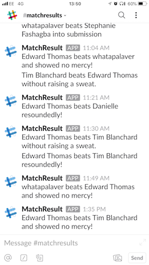

# paddlr  

Final project is hosted in Heroku ar [paddlr.live](http://paddlr.live)

## Project Overview:
As this was our final project at Maker's Academy, we decided to pay tribute to its table-tennis culture by creating an application dedicated to the art. The application will link to user's slack accounts, where games can be arranged, players can be ranked and tournaments can be generated.

## Day 1: Wireframe using Adobe XD


## Contributors:
* [Angela Wolff](https://github.com/Whatapalaver)
* [Danielle Booysen](https://github.com/dani-boo)
* [Edward Thomas](https://github.com/edthomas93)
* [Stephanie Fashagba](https://github.com/stephfash)
* [Tim Blanchard](https://github.com/tblanchard01)

## Demo
(To be added)

Slack Integration with Smack Talk in the Channel:  


## Quickstart
#### How to install the code:
1. Clone this project ```git clone https://github.com/paddlr/paddlr.git```
2. Change into the directory ```cd paddlr```
3. We have our project split into frontend and backend folders which are self contained so to quickly install all dependencies run `npm run install:all`
4. To run tests you need to cd into the relevant folder and run `npm run test`
5. To start the local server cd into frontend and run `npm start`
6. You can also test the hosted app on [paddlr.live](http://paddlr.live)
7. In order to see the Slack integration with the message sending feature you would need to join the [paddlr slack channel](https://join.slack.com/t/paddlr-live/shared_invite/enQtNDQwMDA5NTcyNDgxLTQ3YmFjM2VlNDgwOTJkNGVmOTRkMzQ0YWFjNTJhMzY1Y2M1MWYyNDRkOTRjYTgwZWQ2YmU2YTVjNGEwNmI0YWQ) you will need to join the matchresults channel, which is hidden initially.

## Work Flow - Tickets
[Trello](https://trello.com/b/yJJBQTt1/team-paddlr)

## Project MockUp
(To be added)

## Development Process
#### MVP
* Build a single page app in React where user's can have their points counted for a single game of table-tennis.
* Points for each plater are counted by clicking a score button underneath the player's profile picture until a winner has been determined.
* Have an [API that's fully-documented](https://github.com/paddlr/paddlr/blob/master/backend/README.md) and validated that has game and user routes.

### Testing and Code Quality 

*Frontend*
- cd Frontend 
- `npm test --coverage`

*Backend*
- cd backend
- Eslint. Run `npm lint` to run through the model and view components.  
- Istanbul. To test coverage.
- Mocha is our test runner
- Chai is our BDD/TDD assertion library
- Run `npm test` within the backend folder run the tests and display the coverage report.

## Objectives
In a meeting before we had settled on the details we discussed what we wanted to get out of the project:

* Build a web app that could leave a legacy at Maker's
* Consolidate our learning from the previous 10 weeks
* Follow a TDD approach
* Write clean, readable code and ensure knowledge sharing
* Agile ceremonies: 9.30am stand-ups, check-ins and retros
* Pair programming and 2 day sprints
* XP values, especially communication, simplicity and respect

##  Completed User Stories:

```
As a referee
So I can easily add players
I would like to be able to select paddlrs from our Slack channel
```
```
As a referee,
So I can easily keep track of the score,
I would like to click on the player that won the point to award it
```
```
As a referee,
So I know who's serve is next,
I would like a next serve indicator
```
```
As an excitable referee,
In case I make a mistake,
I would like to undo my previous move
```
```
As a referee,
So I know who has won the game,
I would like to be notified once a winner has been determined
```
```
As a paddlr,
So I know my ranking in my group,
I would like to see where I feature in my group's league table
```
```
As a paddlr,
Who likes to gloat,
I would like my results to be posted in the Slack channel
```
```
As a user,
Who owns multiple devices,
I would like the app to be responsive
```


## Future User Stories:
```
As a spectator,
So I don't get bored,
I would like to see appealing animations
```
```
As a paddlr,
So I don't have to always bring my 'A' game,
I would like to choose if a match is friendly or competitve
```
```
As a paddlr,
So my competitors will be notified,
I would like to organise games via Slack
```
```
As a paddlr,
So I can notify competitors that I want to play,
I would like to organise games via Slack
```
```
As a paddlr,
So I can find tournaments to play in,
I would like to select or create tournaments via Slack
```
```
As a paddlr,
So I don't have to organise games for tournaments,
I would like fixtures to be automatically generated
```
```
As a paddlr,
So I can easily find players to play,
I can mark myself as available for a game
```

Project Diary
=====
Team Paddlr have been maintaining a diary throughout the challenge which can be found here: [Team Diary](https://github.com/paddlr/paddlr/blob/master/docs/team_diary.md)

Team Wiki
=====
Tips, tricks and other resources have been collected in our project [wiki](https://github.com/paddlr/paddlr/wiki)
